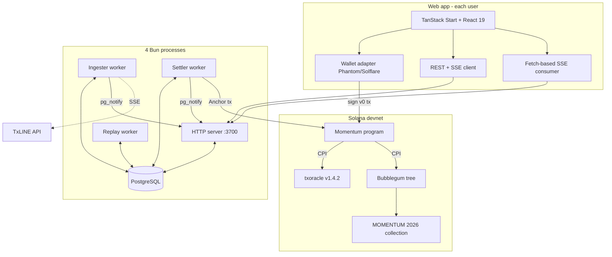

<div align="center">


**On-chain football predictions with cryptographically verifiable settlement, powered by TxLINE on Solana.**

<br />


<br />

Momentum is a consumer prediction game for the 2026 FIFA World Cup where every settled prediction becomes a compressed NFT sticker, cryptographically bound to the exact TxLINE Merkle proof that produced it. No trust-me-bro scoring. No admin key rewriting outcomes. No platform disappearing with your collection. The whole loop lives on Solana devnet today with real transactions any judge can click.

Built for the **TxODDS World Cup Hackathon** in the **Consumer & Fan Experiences** track. Solo build by **Louis** (Team Momentum).

</div>

---

## The problem, the solution, the stack

### The problem

Prediction games are trust-me-bro.

The user picks an outcome. A centralized server records it. The match ends. The same server tells the user whether they won. Rewards get credited. The user must trust the operator every step of the way — the odds are correct, the outcome was scored honestly, the payout wasn't clipped, the collectible NFT is really mine.

For sports specifically, the data pipeline is opaque:

- **Score feeds** come from privately-operated APIs
- **Outcomes** are written by admin keys watching ESPN
- **Fantasy platforms** hold your team, your points, and your winnings inside their own database
- **Collectible NFTs** on other platforms are stamped from a spreadsheet, not a proof

None of it is verifiable. If a platform disappears, so do your collectibles and your history. If a bookmaker slips a decimal, you have no recourse. If FIFA changes its distribution plans, the app pivots and your group chat evaporates.

### The solution

Momentum flips the trust boundary. Every sticker cNFT is cryptographically bound to a TxLINE Merkle proof, verified by the Solana program itself in the same instruction that mints the NFT.

The settlement path is one atomic transaction:

1. **TxLINE `validate_stat` CPI** — the Momentum Anchor program calls into `txoracle` v1.4.2 on Solana devnet and passes the fixture, predicate, and Merkle proof
2. **`txoracle` re-derives** the `daily_scores_roots` PDA and validates the proof on-chain against its own anchored Merkle roots
3. **Only if the proof is valid** does execution reach the Bubblegum `MintToCollectionV1` CPI
4. **Every sticker minted** from that path carries `event_stat_root` + `proof_ts` in its account state and in the emitted event

If the proof is bad, the whole transaction reverts. No sticker exists. Ever.

The user does not need to trust the operator. The operator does not need to trust the oracle. The oracle does not need to trust the user. All three trust the Merkle path.

### Why the Solana + TxLINE stack

Momentum did not need a research project to choose these primitives. Two things fit exactly:

- **Solana** gives us the economics. Bubblegum compressed NFTs at approximately `$0.00005` per leaf mint (verified: rent-exempt PredictionCard PDA costs `0.005 SOL`, and a full settle+mint tx is `~0.000005 SOL` in fees). Un-viable on any other L1. Plus Solana Actions ("Blinks") let a share-card unfurl as a signable button directly inside X, Discord, and Telegram.
- **TxLINE** gives us the primitive. TxODDS ships an on-chain oracle (`txoracle` program) that verifies Merkle proofs of match statistics inside a CPI. Downstream programs (Momentum) gate their own logic on the CPI succeeding. **This is the exact "verifiable settlement" narrative TxODDS is selling their B2B customers.** Momentum makes it visible on a consumer's screen.

### How the three layers reinforce each other

- **The Anchor program carries the trust.** Every sticker mint is gated on a TxLINE CPI that any peer can audit on Solscan by clicking the tx sig
- **The backend carries the orchestration.** Ingester consumes TxLINE's SSE stream, classifies scoring events, enqueues settlement jobs, settler builds v0 transactions with Address Lookup Tables and fires them at the correct compute budget
- **The web carries the receipt.** Killer 4-second Merkle-proof reveal ceremony plays when a slot settles; every sticker in the album deep-links to the on-chain proof

**Every layer is exercised in the same end-to-end path** — a real user's prediction card was submitted from the web UI on July 19, 2026 at wallet `E6yf2iGy6jFYh9Rrp6NKcbgRmWpd8tK9MqDeo8WfMgmJ`, on-chain PDA `HcfGjHdDwP2GDA4v6DtXj5G1PZPuqETS67BEsMvdGRrJ`, verifiable right now on Solscan devnet.

---

## Try it in 60 seconds

**Verify the contract is live on Solana devnet without installing anything:**

```bash
solana program show 39oqYsjuQLkFLEieaP7tisN8Bq4K8A2fS2gttKaFwTAT --url devnet
```

Expected output includes `Program Id: 39oqYsjuQLkFLEieaP7tisN8Bq4K8A2fS2gttKaFwTAT`, executable = true, last-deployed slot > 477000000.

**Fetch the deployed IDL from chain:**

```bash
anchor idl fetch 39oqYsjuQLkFLEieaP7tisN8Bq4K8A2fS2gttKaFwTAT --provider.cluster devnet
```

Returns the full 13-instruction Anchor IDL including `submit_predictions`, `settle_prediction`, `claim_match_card`, `list_for_sale`, `buy_card`, `distribute_prize`, and the two admin `initialize_*` instructions.

**Verify a real killer settlement transaction:**

Open [`24JM8XGgFpGxm5uJ6eWAvb9j7xnovk1wqsErfcWGM1MERaH6hsXCBV8ZceDYnHNPiANY48QxQtnZVZo2ZMeUqv6g`](https://solscan.io/tx/24JM8XGgFpGxm5uJ6eWAvb9j7xnovk1wqsErfcWGM1MERaH6hsXCBV8ZceDYnHNPiANY48QxQtnZVZo2ZMeUqv6g?cluster=devnet) on Solscan devnet. You will see:

- Inner instruction: TxLINE `validate_stat` CPI (proof accepted)
- Inner instruction: Bubblegum `mint_to_collection_v1` CPI (cNFT minted)
- `StickerMinted` event emitted with `event_stat_root = 24ebb28c9f8a...` (byte-for-byte match to the TxLINE proof root)

This is the entire product loop compressed into one atomic tx: a Merkle proof verified, a collectible minted, an event emitted. All in ~933 bytes via Address Lookup Table.

---

## Track entered

| Track | Role | Prize pool |
|---|---|---|
| **Consumer & Fan Experiences** | Primary | $10K first place |

Momentum specifically targets the consumer track because Solana devs typically ship deep protocol integrations but weak consumer UX. Consumer track has the fewest crypto-native submissions and the most opportunity for a polished product.

---

## Live proof

### Deployed on Solana devnet

| Artifact | Address | Purpose |
|---|---|---|
| Momentum program | `39oqYsjuQLkFLEieaP7tisN8Bq4K8A2fS2gttKaFwTAT` | 13-instruction Anchor program |
| Program data | `4UFjiAgrhyoTK19sTtLRcFMHvXGqWVvAnQeVdWJ79wmz` | Program bytecode account |
| IDL account | `G3wiyk7Q4L1t2zfxaxeZnWKyd71kqLQph46Y89Nqy6on` | On-chain IDL for client discovery |
| Bubblegum tree | `2jKMbtBFhgnsPNNQnz9awKzDBpgisPSa87pDg5ZiU5PX` | Compressed NFT storage tree |
| Tree config | `FH11cU3FJZGyutv6DKynbncjnkK8aTf1NwCBQD1cCfdc` | Bubblegum tree_config PDA (delegate = mint_auth) |
| TreeState PDA | `9oMjwx2AdLMckkNSPD1ytsipLxVwXJmYtbY1e1aNnYYr` | Program's binding to the tree |
| CollectionState PDA | `Kh4o5Ahpk8hzXtnKZHJ7cVCU6eod4BW4urzofyoxFrj` | Program's binding to the collection |
| Collection mint | `CJwWJmcMT3KyRq43fiXY7NZKAxYWg8759YcKaNL2Kbqg` | MOMENTUM 2026 collection NFT |
| Collection metadata | `m82nwvqoxZ27LnfjeMzCGe7j1XsQQMdHTWhm4C6vk3D` | Metaplex collection metadata |
| Collection edition | `Fen6DcmpQK6gkFYqom8BuSCEps54X9shY763XyLU56tL` | Metaplex master edition |
| mint_auth PDA | `FqUTz5Fmy8WXEvzkJhrsa1kTfsX6L1ox7cBgLmjPkb41` | Program-owned signer for every mint |
| Address Lookup Table | `E6HMUAQswijWbVDAz2L884y9QbTmqj96Tt9VKky1rLH9` | Compresses settle tx from ~2000B → 933B |

### TxLINE oracle (sponsor's program, we consume via CPI)

| Artifact | Address |
|---|---|
| `txoracle` v1.4.2 devnet | `6pW64gN1s2uqjHkn1unFeEjAwJkPGHoppGvS715wyP2J` |

### Real end-to-end transactions

| # | What | Tx sig | Solscan |
|---|---|---|---|
| 1 | Program initial deploy | `5x95qehSjC74P11PCDFV7MA9F5bFsrqEV6sceryr6CDr16NR6prTC2xMaWpihLBEqCnteaWfVuXfv2T37eHSwsfW` | [view](https://solscan.io/tx/5x95qehSjC74P11PCDFV7MA9F5bFsrqEV6sceryr6CDr16NR6prTC2xMaWpihLBEqCnteaWfVuXfv2T37eHSwsfW?cluster=devnet) |
| 2 | initialize_tree_state | `5P9cRs97PGmZnv9cJJonovryzkAsozqUdjghdPYbmeADo3ffaccAZXLv6bKD7zGhFfKQGB6TFZ4mpD1gLnvS4YbA` | [view](https://solscan.io/tx/5P9cRs97PGmZnv9cJJonovryzkAsozqUdjghdPYbmeADo3ffaccAZXLv6bKD7zGhFfKQGB6TFZ4mpD1gLnvS4YbA?cluster=devnet) |
| 3 | TxLINE `subscribe(1, 4)` activation | `2PccbeQx4TfmKkpMhcqkBAZRkairNCK2QgMbqCT7tNLxCtAegAu4jj4CFgbiHtLGQ7QLHMojn4siAcrTcGvYvYvN` | [view](https://solscan.io/tx/2PccbeQx4TfmKkpMhcqkBAZRkairNCK2QgMbqCT7tNLxCtAegAu4jj4CFgbiHtLGQ7QLHMojn4siAcrTcGvYvYvN?cluster=devnet) |
| 4 | **Killer settle_prediction (HIT + cNFT mint)** | `24JM8XGgFpGxm5uJ6eWAvb9j7xnovk1wqsErfcWGM1MERaH6hsXCBV8ZceDYnHNPiANY48QxQtnZVZo2ZMeUqv6g` | [view](https://solscan.io/tx/24JM8XGgFpGxm5uJ6eWAvb9j7xnovk1wqsErfcWGM1MERaH6hsXCBV8ZceDYnHNPiANY48QxQtnZVZo2ZMeUqv6g?cluster=devnet) |
| 5 | Backend-driven settle_prediction | `4fH7oq6RhWyUnKSUTcRSx7vYYGKKt8kHSQigHtsW7gZoGwaZ4U8pbbSoxcJvrevsUMABAQT6GMaowtRYrQPc2oQ2` | [view](https://solscan.io/tx/4fH7oq6RhWyUnKSUTcRSx7vYYGKKt8kHSQigHtsW7gZoGwaZ4U8pbbSoxcJvrevsUMABAQT6GMaowtRYrQPc2oQ2?cluster=devnet) |
| 6 | claim_match_card (first) | `24mEF77YJXGfJMW5qyoHfxzenyrF3aTUiKvfsaRjYAjZttcBafoAsozg1WnKU5fQpPoLr6kwz5eCkb5z3rkDUqYc` | [view](https://solscan.io/tx/24mEF77YJXGfJMW5qyoHfxzenyrF3aTUiKvfsaRjYAjZttcBafoAsozg1WnKU5fQpPoLr6kwz5eCkb5z3rkDUqYc?cluster=devnet) |
| 7 | claim_match_card (second) | `54jNvFvTAd7ndbxrrWAejsAJh1ep7PELe2cc5kPzH4nZiRSJ9p13xUt4q27wL6xgmpaZmephi74LHASh2RbayKE3` | [view](https://solscan.io/tx/54jNvFvTAd7ndbxrrWAejsAJh1ep7PELe2cc5kPzH4nZiRSJ9p13xUt4q27wL6xgmpaZmephi74LHASh2RbayKE3?cluster=devnet) |
| 8 | Marketplace list_for_sale | `3fWbc4QCF7z9aABKWkyWLcQ9Lytnv1pPBCHqxKu4dFjzkyTeKGHNsKKG6FkeV4oPsEaNqUDbhtcpmaMwDd3kXUf8` | [view](https://solscan.io/tx/3fWbc4QCF7z9aABKWkyWLcQ9Lytnv1pPBCHqxKu4dFjzkyTeKGHNsKKG6FkeV4oPsEaNqUDbhtcpmaMwDd3kXUf8?cluster=devnet) |
| 9 | Marketplace buy_card | `458X2xSpZGmUTvSmP9gcgz6JhvWjwCMuKExDE2EL8UficK9swDmgCtgk9H82PECaUxq8oycDEDAEfogLGHYuTTmv` | [view](https://solscan.io/tx/458X2xSpZGmUTvSmP9gcgz6JhvWjwCMuKExDE2EL8UficK9swDmgCtgk9H82PECaUxq8oycDEDAEfogLGHYuTTmv?cluster=devnet) |
| 10 | Program upgrade (Pass 7, collection ixs) | `2yepSUKCn4BYXqmEhrN6ZsGxtCmN7sVP92yf7vLsBqnbz9MtFEEE8iE9irpdKGEr9s4TP5M1sidnRcG8NCAYCdQz` | [view](https://solscan.io/tx/2yepSUKCn4BYXqmEhrN6ZsGxtCmN7sVP92yf7vLsBqnbz9MtFEEE8iE9irpdKGEr9s4TP5M1sidnRcG8NCAYCdQz?cluster=devnet) |
| 11 | Program upgrade (Pass 10, distribute_prize) | `4XWnNQGPhGcQ6kvgoVcgvxU8n1Bs4MmJyaZjdjUB7aGDMqLjV6Ya2Cghm3TtGikxY6sV3xGcJAZjCmKfdLHizWD3` | [view](https://solscan.io/tx/4XWnNQGPhGcQ6kvgoVcgvxU8n1Bs4MmJyaZjdjUB7aGDMqLjV6Ya2Cghm3TtGikxY6sV3xGcJAZjCmKfdLHizWD3?cluster=devnet) |
| 12 | **Web-UI-driven prediction submit** (first real UI submission) | `37LNBNxy9wYsZhtvCrgmzueu4wXTpo3nJHpCqocDJai7otbBxvoMyMqgEY6qKRccTF95zkDVmTuWArL8QN3oWhP4` | [view](https://solscan.io/tx/37LNBNxy9wYsZhtvCrgmzueu4wXTpo3nJHpCqocDJai7otbBxvoMyMqgEY6qKRccTF95zkDVmTuWArL8QN3oWhP4?cluster=devnet) |

---

## Solana + TxLINE integration in detail

Momentum does not treat the Anchor program, the backend, and the web as three separate features glued together. Each layer answers a question the others cannot.

### Anchor program (`momentum_contract`) — 13 instructions

| Instruction | What it does | Who signs | Key primitives |
|---|---|---|---|
| `initialize_tree_state` | Binds the Bubblegum tree to the program, records mint_auth bump | Admin (once) | Anchor `init`, PDA seeds `["tree_state"]` |
| `initialize_collection_state` | Registers the MOMENTUM 2026 collection mint | Admin (once) | Anchor `init`, PDA seeds `["collection_state"]` |
| `create_group` | Opens a new prediction group with entry fee + max size | User (creator) | Group PDA seeded by `group_id`, vault PDA |
| `join_group` | Adds a member, optionally transfers entry fee to vault | User | Membership PDA, `system_program::transfer` CPI |
| `pause_group` / `unpause_group` | Admin kill switch on any group | Admin | GroupExtension PDA sidecar (schema-safe upgrade pattern) |
| `submit_predictions` | Writes 1-8 prediction slots to a card PDA | User | Anchor `init`, `PredictionSlot; 8` fixed array |
| `settle_prediction` | THE load-bearing ix: verifies TxLINE proof, mints sticker | Keeper (backend) | CPI to `txoracle::validate_stat` + `mpl_bubblegum::mint_to_collection_v1` |
| `claim_match_card` | Mints the summary match-card cNFT at `game_finalised` | Keeper | Same CPI stack + `PredictionCard.match_card_minted` guard |
| `list_for_sale` | Delegates a cNFT to the escrow PDA + creates Listing | User (seller) | CPI to Bubblegum `delegate`, `#[instruction(asset_id)]` PDA seed |
| `buy_card` | Atomic swap: SOL to seller + Bubblegum transfer to buyer | User (buyer) | CEI ordering (`active = false` FIRST), `close = seller` |
| `cancel_listing` | Reverses delegate, closes Listing | User (seller) | `has_one = seller` |
| `distribute_prize` | Splits group vault proportional to member hit-scores | Admin or group creator | Iterates `remaining_accounts` for members, `checked_add` throughout |

Anchor 0.31.1 with mpl-bubblegum 2.1.1. Program built at 539KB, tested with `solana-bankrun` for deterministic CPI paths.

The load-bearing `settle_prediction` handler in one paragraph: guards check the slot isn't already resolved and the leaf_owner matches the card's user. Local integrity checks confirm `stat_a.stat_to_prove.key == slot.stat_a_key` and the predicate matches. Then the TxLINE CPI fires — if the proof is invalid the whole tx reverts. On success, proof lineage (`event_stat_root`, `proof_ts`) persists on the slot, `tree_state.next_index` bumps with `checked_add`, and Bubblegum's `MintToCollectionV1CpiBuilder` fires signed by the `mint_auth` PDA. Finally an enriched `StickerMinted` event emits with the asset_id and full lineage for the frontend to decode.

### TxLINE CPI (sponsor's program, we're the downstream consumer)

TxLINE is TxODDS's on-chain oracle for sports data. `txoracle` v1.4.2 anchors hourly Merkle roots of match statistics; downstream programs (Momentum) can verify any single stat via a `validate_stat` CPI that walks the Merkle path against the on-chain `daily_scores_roots` PDA.

| Component | What it is | How Momentum uses it | Product moment |
|---|---|---|---|
| **`POST /auth/guest/start`** | Guest JWT issuance (30-day TTL) | Backend `bootstrap.ts` obtains the JWT on server boot | Zero user friction — no TxLINE account required |
| **`subscribe(service_level, weeks)` on-chain ix** | Activates a subscription via on-chain marker | Backend submits `subscribe(1, 4)` — free tier is service level 1 on devnet | Required activation, one-time |
| **`POST /api/token/activate`** | Trades tx sig + wallet signature for `X-Api-Token` | Backend signs `${txSig}::${jwt}` with nacl (double-colon literal for empty leagues) | Yields the `X-Api-Token` header for data endpoints |
| **`GET /api/fixtures/snapshot`** | Real fixture list with team names | Backend polls hourly, mirrors to `Fixture` Prisma table | Frontend shows real teams (Spain vs Argentina etc.) |
| **`GET /api/scores/stream`** (SSE) | Live packet firehose | Ingester consumes with manual `\r?\n\r?\n` parser + `gzip` acceptance | Real-time settlement triggers |
| **`GET /api/scores/stat-validation`** | The proof payload for a single stat | Settler fetches on classified scoring events | Feeds the on-chain `validate_stat` CPI |
| **`GET /api/scores/updates/{epochDay}/{hourOfDay}/{interval}`** | Historical packet backfill | Backfill + replay mode consume | Judging-day insurance |
| **`validate_stat(...)` CPI** | The verifiable settlement primitive | Momentum's `settle_prediction` invokes it inside the same instruction as the mint | If proof fails, whole tx reverts — no sticker minted |

**The `daily_scores_roots` PDA discovery** was the load-bearing piece of the integration. TxLINE's IDL declares the account by name but does NOT encode the PDA seeds. Momentum resolved this by cross-referencing TxLINE's example client repo on GitHub: the correct seeds are `["daily_scores_roots", u16_le(epoch_day)]` — no hour or minute components. The account is 9232 bytes and stores all 288 five-minute-interval roots for a single UTC day inline; TxLINE picks the correct offset from the `ts` argument internally. This discovery is what unblocked Momentum's entire settlement path. See [`scripts/derive-daily-scores-root.ts`](momentum_contract/scripts/derive-daily-scores-root.ts) for the working derivation, live-verified against a known devnet account.

### Bubblegum cNFTs (Metaplex)

A traditional Solana NFT mint costs ~0.012 SOL (~$1.50). A Bubblegum leaf mint costs ~0.00005 SOL (~$0.005). Momentum could mint 200,000+ stickers for the cost of a single traditional NFT collection.

| Component | Version | How Momentum uses it |
|---|---|---|
| **`mpl-bubblegum` (Rust)** | 2.1.1 | Every `settle_prediction` + `claim_match_card` uses `MintToCollectionV1CpiBuilder` with the collection binding — every sticker groups under the "MOMENTUM 2026" album in Phantom / Backpack / Solflare wallets |
| **Bubblegum tree** | maxDepth=14, maxBufferSize=64, canopyDepth=8 | Created off-chain via `scripts/create-tree.ts` with `public: false`; delegate handed off to `mint_auth` PDA. 16,384 leaf capacity, ~0.34 SOL creation cost, 6 proof accounts per verify |
| **Tree delegate = `mint_auth` PDA** | Program-signed | Only the Momentum program can invoke `mint_v1` / `mint_to_collection_v1` on the tree. No admin key can spam mints |
| **Metaplex Token Metadata Collection NFT** | Standard | MOMENTUM 2026 collection NFT owned by admin; verified creator = `mint_auth` PDA (100% share) |

### Additional program hardening

| Technique | Where | Why it matters |
|---|---|---|
| **CEI ordering on `buy_card`** | [`buy_card.rs`](momentum_contract/programs/momentum/src/instructions/buy_card.rs) | `listing.active = false` set BEFORE any CPI + `close = seller`. Prevents double-buy |
| **`stat_a_key` local integrity check** | [`settle_prediction.rs`](momentum_contract/programs/momentum/src/instructions/settle_prediction.rs) | Program re-checks the CPI arg stat key equals `slot.stat_a_key`. Keeper cannot substitute a bogus stat |
| **MISS negation policy** | Same file | For `outcome_claim == MISS`, program requires submitted predicate to be a valid negation (comparison differs, threshold matches). Keeper can't claim MISS with a weaker predicate |
| **Compound stat guards** | Same file | `stat_b` presence must match `slot.stat_b_key != 0`. Mismatched compound → `MissingCompoundStat` / `UnexpectedCompoundStat` errors |
| **`GroupExtension` sidecar PDA (Pass 10)** | [`state.rs`](momentum_contract/programs/momentum/src/state.rs) | Added `paused` + `prize_distributed` fields via a NEW PDA at `["group_ext", group_pda]` instead of extending `Group`. Old Group accounts survive the program upgrade untouched |
| **Verified-creator = `mint_auth` PDA** | `MetadataArgs.creators` in settle handler | Third-party creators cannot pass `verified: true` because only `mint_auth` can sign the mint CPI |
| **`is_mutable: false` on every sticker** | Same | Sticker metadata is permanent after mint. No admin key can rewrite the outcome |
| **Cached bumps on Group, Membership, PredictionCard** | State structs | Skips PDA re-derivation on every access (~1500 CU saved per ix) |
| **Address Lookup Table for settle** | [`settle.ts`](backend/src/lib/solana/settle.ts) in backend | 20+ accounts compress into ~933 bytes of tx wire via ALT `E6HMUAQ...LH9`. Without ALT the tx exceeds the 1232-byte legacy limit |
| **`skipPreflight: true` on send** | Same | Devnet preflight is flaky (rate limits + stale simulation state). Rely on confirm + `.err` check instead |
| **Blockhash strategy on confirm** | Same | Uses the ORIGINAL blockhash the tx was signed with (not a fresh one). Correct per Solana's `TransactionConfirmationStrategy` spec |
| **On-chain event enrichment** | [`events.rs`](momentum_contract/programs/momentum/src/events.rs) | `StickerMinted` + `MatchCardClaimed` events carry `event_stat_root`, `proof_ts`, `asset_id`, `merkle_tree` so backend decodes them into SSE payloads without re-fetching |

### Backend (`backend/`) — 4 processes

Four independently restartable Bun processes, all pointing at the same Postgres database and the same on-chain program.

| Process | Purpose | Key primitives |
|---|---|---|
| **HTTP server** (`bun run dev`) | REST + SSE + Blinks API on port 3700 | Fastify v5, Prisma v7 (PG driver adapter), `@fastify/jwt`, `@fastify/rate-limit`, `@fastify/helmet`, `@fastify/swagger`, structured Pino logs with redaction |
| **Ingester** (`bun run worker:ingester`) | Consumes TxLINE SSE stream | Manual SSE parser, state machine `IDLE → CONNECT → OPEN → (401) REAUTH → (drop) BACKFILL → OPEN`, per-fixture monotonic seq tracking, gzip-accepted (70-80% bandwidth savings) |
| **Settler** (`bun run worker:settler`) | Processes SettlementJob queue → v0 tx with ALT → confirms | Anchor client (`@coral-xyz/anchor` 0.32), keeper signer, exponential backoff on retries, compute-unit escalation (20k → 50k → 100k microLamports) |
| **Replay** (`bun run worker:replay`) | Judging-day insurance | Virtual clock keyed off archived `ScorePacket.ts`, re-emits at natural cadence at 1× to 1000× speed, `pg_notify` publishes to same channel as live ingester |

### Backend data model (Prisma)

14 models across the domain:

| Model | Purpose |
|---|---|
| `User` | SIWS-authenticated wallet |
| `Session` | Nonce challenges (5-min TTL, single-use) |
| `TxlineSession` (singleton) | JWT + API token cache |
| `TxlineJwt` | Rotation audit log |
| `Fixture` | Match snapshot mirror |
| `ScorePacket` | Raw TxLINE packet archive (unique on `[fixtureId, seq]`) |
| `ProofCache` | Fetched stat-validation payloads |
| `Group` | On-chain group mirror |
| `Membership` | Group members |
| `PredictionCard` | On-chain card mirror |
| `StickerMint` | Minted cNFT records with full lineage |
| `MatchCard` | Match summary cNFT records |
| `Listing` / `Sale` | Marketplace records |
| `SettlementJob` | Queue table (pending / in_progress / done / error) |

### Backend cross-process pub/sub

Ingester runs as a separate process (restart isolation). To fan out packet events to HTTP-process SSE subscribers, Momentum uses **Postgres `LISTEN` / `NOTIFY`** — a native primitive that requires zero extra infrastructure. The alternatives (Redis pub/sub, file-based ring buffer) were rejected because they either add a new service dependency or aren't real-time.

### Web (`web/`) — TanStack Start + React 19

15 routes, wallet-connected, SIWS-authed, real-time via SSE.

| Screen | What it is | Key primitives |
|---|---|---|
| **Landing** (`/`) | Hero with GSAP timeline + live stats + closing CTA | GSAP `power3.out` orchestrated entrance, `motion` `layoutId` sliding pill nav |
| **Fixtures** (`/fixtures`) | Real match list from TxLINE snapshot, sorted soonest-first | Segmented filter (Live/Upcoming/Finished), status-aware routing |
| **Fixture detail** (`/fixtures/$id`) | Match hero + "Your prediction card" section + Watch Live CTA | `predictionMeOptions` query with reverse-mapped stat labels (statAKey → "Match total — Goals · Second half") |
| **Predict** (`/fixtures/$id/predict`) | 1-8 slot builder | Correct P1/P2 TxLINE encoding, compound `stat_a + stat_b + op:Add` for "Match total", 7-period selector with helper hints |
| **Live Match View** (`/fixtures/$id/live`) | SSE-driven live event feed + reveal ceremony triggers | Fetch-based `ReadableStream` SSE consumer, Postgres LISTEN bridge to backend |
| **Album** (`/album`) | User's sticker collection | Helius DAS fallback to Prisma mirror, procedural `StickerArt` SVG, lineage modal on click |
| **Marketplace** (`/market`) | Live listings + list/buy flow | Same v0 tx + ALT pattern from backend, Blinks share button (dial.to unfurl) |
| **Docs** (`/docs`) | 12-section technical documentation with live HealthWidget | Vite `import.meta.glob` loads `.md` files, `react-markdown` + `remark-gfm` + `rehype-raw`, sticky TOC with scroll-following active highlight |
| **Profile** (`/profile/$wallet`) | Public stats + activity feed | Backend `/api/users/:wallet` aggregation |
| **Style guide** (`/style-guide`) | 13-section design system reference | All 12 component patterns + typography + color swatches |

### The killer demo moment

The "Merkle-proof reveal" is the 15-second visual that defines the demo. Implemented as `StickerRevealCurtain.tsx` — a 4-second GSAP timeline:

1. **0-400ms** — Screen dim + "GOAL!" title flies up (Bricolage Grotesque hero)
2. **400-1200ms** — Gold/silver receipt card slides in with monospace data (`fixture_id`, `slot_index`, `event_stat_root` truncated, `proof_ts`)
3. **1200-2200ms** — 4-node Merkle path animates itself node-by-node with pixel-shimmer, `stroke-dasharray` line growth, staccato `momentum-tick` easing per node
4. **2200-3000ms** — Merkle tree folds into a hexagonal collectible with confetti burst (pixel-art squares in category colors)
5. **3000-3800ms** — Sticker slides to slot position in the PredictionCard, slot flips HIT/MISS
6. **3800-4000ms** — Solscan toast slides in ("Verified sticker minted — view on Solscan")

Web Audio API SFX (whistle, tick per Merkle node, chord on fold, chime on match-card LEGENDARY) synthesized on the fly — no audio files needed. Full `prefers-reduced-motion` respect.

Demo-triggerable at `http://localhost:3200/fixtures/18257739/live?trigger=demo` with no wallet or backend required.

### Additional web hardening

- **View Transitions API** for dark/light theme swap — circular clip-path expansion from click coordinates (420ms cubic-bezier)
- **Buffer polyfill** for browser wallet-sign path (root-cause fix that unblocked prediction submission end-to-end)
- **Auto-SIWS on wallet connect** — no manual "sign in" button, auto-triggered via `useEffect` guarded by `useRef` to prevent loop-prompting on rejection
- **JWT-only 401 clearing** — api client only wipes stored JWT when the failing request actually sent an auth header (prevents 401-on-unauth-endpoint from wiping a valid JWT for parallel flows)

---

## Architecture Decision Records

Every non-obvious design choice is captured. The most load-bearing:

- **ADR-001 One PredictionCard per (user, fixture) via Anchor `init`** — enforced by the PDA seed `["card", user_pubkey, fixture_id]`. Card is immutable after `submit_predictions`; editing predictions requires a new fixture or new wallet
- **ADR-002 `GroupExtension` sidecar PDA for schema upgrades** — Rejected extending `Group` directly because existing on-chain accounts wouldn't deserialize with new fields. Sidecar at `["group_ext", group_pda]` initialized lazily is invisible to legacy Group readers
- **ADR-003 `stat_key = period_prefix + base_key` mapping** — TxLINE's actual base keys are 1-8 (P1/P2 × Goals/Yellow/Red/Corners), not our imagined Total/Home/Away scheme. Home/Away resolves via `Participant1IsHome` fixture flag; Match total via compound `stat_a + stat_b + op:Add`
- **ADR-004 `mint_auth` PDA as sole Bubblegum tree delegate** — Tree created with `public: false`, delegate handed off to `mint_auth` PDA. Only the Momentum program can invoke mint via signer_seeds
- **ADR-005 Postgres `LISTEN` / `NOTIFY` for cross-process pub/sub** — Rejected Redis (extra service), file-based ring buffer (not real-time). Postgres is already required for Prisma
- **ADR-006 `skipPreflight: true` on Solana sends** — Devnet preflight is flaky. Rely on `confirmTransaction` with explicit `.err` check + on-chain log fetch on failure
- **ADR-007 View Transitions API for theme swap** — Circular clip-path expansion from cursor, ~420ms. Falls back to instant swap on browsers without support OR `prefers-reduced-motion`
- **ADR-008 Buffer polyfill via `buffer` npm package** — Rejected `node:buffer` (Vite externalizes it, throws in browser). The `buffer` npm shim is browser-native, bound to `globalThis.Buffer` at module load

---

## What to click if you only have 90 seconds

1. **Killer settle_prediction transaction on Solscan devnet** — [`24JM8XGgFp...`](https://solscan.io/tx/24JM8XGgFpGxm5uJ6eWAvb9j7xnovk1wqsErfcWGM1MERaH6hsXCBV8ZceDYnHNPiANY48QxQtnZVZo2ZMeUqv6g?cluster=devnet). Expand inner instructions to see `validate_stat` CPI followed by `mint_to_collection_v1` CPI in one atomic tx.
2. **The load-bearing handler** — [`settle_prediction.rs`](momentum_contract/programs/momentum/src/instructions/settle_prediction.rs). 261 lines. Read the CPI stack lines and the state-lineage lines.
3. **The killer reveal ceremony** — [`StickerRevealCurtain.tsx`](web/src/components/StickerRevealCurtain.tsx). 6-phase 4-second GSAP timeline.

Everything else fans out from those three.

---

## Architecture

Three subtrees, one story. The Anchor program is the trust root. The backend orchestrates. The web renders the receipt.



---

## Repo layout

| Path | What it is | Tech |
|---|---|---|
| [`momentum_contract/`](momentum_contract/) | The Anchor program | Rust + Anchor 0.31.1 + mpl-bubblegum 2.1.1 |
| [`backend/`](backend/) | The API + workers | Bun 1.3 + Fastify 5 + Prisma 7 + PostgreSQL |
| [`web/`](web/) | The user-facing app | TanStack Start + React 19 + Tailwind 4 + GSAP |

Each subproject ships its own README with a local quickstart.

---

## Run locally

### Prerequisites

| Tool | Version | Purpose |
|---|---|---|
| Rust | 1.93+ | Anchor build |
| Anchor CLI | 0.31.1 | Anchor commands |
| Solana CLI | 2.3.12 (Agave) | Program deploy, key management |
| Bun | 1.3+ | Backend + web runtime |
| PostgreSQL | 16 | Backend database |
| Node.js | 20+ | Some Anchor tooling |

### Contract (already deployed — verify only)

```bash
cd momentum_contract
anchor keys list
solana program show 39oqYsjuQLkFLEieaP7tisN8Bq4K8A2fS2gttKaFwTAT --url devnet
anchor idl fetch 39oqYsjuQLkFLEieaP7tisN8Bq4K8A2fS2gttKaFwTAT --provider.cluster devnet
```

For local bankrun tests:

```bash
cd momentum_contract
yarn install
yarn ts-mocha -p ./tsconfig.json -t 1000000 tests/**/*.ts
```

Expected: 19 passing, 5 pending, 0 failing.

### Backend

```bash
cd backend
bun install
cp .env.example .env                    # fill in DATABASE_URL, SESSION_JWT_SECRET, KEEPER_KEYPAIR_PATH
bunx prisma migrate dev                 # apply migrations
bun run dev                             # HTTP server on :3700
```

In separate terminals:

```bash
bun run worker:ingester                 # TxLINE SSE consumer
bun run worker:settler                  # SettlementJob queue processor
bun run worker:replay                   # (optional) judging-day replay
```

Verify:

```bash
curl -s http://localhost:3700/health | jq
```

Expected: `status: "ok"`, `workers.ingester: "live"`, `workers.settler: "live"`, `txlineAuth: "live"`.

### Web

```bash
cd web
bun install
cp .env.example .env                    # VITE_API_URL, VITE_SOLANA_RPC_URL etc.
bun run dev                             # http://localhost:3200
```

Open [http://localhost:3200](http://localhost:3200).

### Seed demo content (optional)

The album and marketplace pages depend on real minted stickers. To populate for a demo:

```bash
cd backend
bun run scripts/seed-demo-content.ts <yourWalletBase58>
```

This inserts 3 StickerMint rows (2 HIT, 1 MISS) and 1 active Listing using REAL Pass 8 proof data.

---

## What is real vs staged

Honest checklist. Every "verified" row is clickable on Solscan devnet.

| Item | Status | Evidence |
|---|:---:|---|
| Anchor program deployed on devnet | ✅ | `solana program show 39oqYs...` |
| Program upgraded twice on devnet | ✅ | Upgrade txs `2yepSU...` and `4XWnNQ...` |
| IDL uploaded on-chain | ✅ | `anchor idl fetch 39oqYs...` returns 13 instructions |
| MOMENTUM 2026 collection NFT live | ✅ | Collection mint `CJwWJm...` on Solscan |
| Bubblegum tree delegate = mint_auth PDA | ✅ | Tree config `FH11cU...` on Solscan |
| End-to-end `settle_prediction` with real TxLINE proof | ✅ | Pass 8 tx `24JM8X...` inner instructions |
| Backend-driven `settle_prediction` (settler worker) | ✅ | Phase C tx `4fH7oq...` |
| Marketplace `list_for_sale` + `buy_card` | ✅ | Txs `3fWbc4...` and `458X2x...` |
| Web UI-driven `submit_predictions` | ✅ | Tx `37LNBN...`, card PDA `HcfGjH...` |
| Real TxLINE Merkle proof captured + used in a live settlement | ✅ | Fixture 18237038 seq 732 statKey 2 |
| Live TxLINE data during judging window | ⏳ | Replay mode covers this — see below |
| Public deployment | 🚧 | Local now; deploy to Fly.io + Vercel is next |
| Mainnet | ❌ | Cup rules disallow. Devnet only for this submission |

### Judging-day insurance: replay mode

TxLINE has no live matches during the judging window (World Cup ends July 19, 2026). Momentum's **replay worker** solves this:

```bash
cd backend
REPLAY_FIXTURE_ID=18237038 REPLAY_SPEED=100 bun run worker:replay
```

Reads archived `ScorePacket` rows from Postgres, re-emits them at the natural cadence keyed off original `Ts` values, at 1× to 1000× speed. Every code path downstream (classifier → SettlementJob queue → settler → CPI stack) is identical to the live path. Judges see a real settlement fire without waiting for FIFA to schedule a match.

The live view renders a persistent **REPLAYING [Match Name] · MM:SS elapsed** pill in the top-right of the fixture header when the replay worker is driving the stream. Judges never mistake replayed activity for staged data.

---

## Scale: 104 games at cNFT cost

The reason Solana wins this track is economics.

| Cost model | Regular NFT (Metaplex Token Metadata) | Compressed NFT (mpl-bubblegum) |
|---|---|---|
| Rent per mint | ~0.012 SOL | ~0.000005 SOL |
| USD equivalent (SOL @ $170) | ~$2.04 | **~$0.00085** |
| One user's full album (8 stickers × 104 matches = 832 stickers) | ~$1,700 | **~$0.71** |
| 1,000 fans, full albums (832,000 stickers) | ~$1.7M | **~$710** |
| 10,000 fans, full albums (8.32M stickers) | ~$17M | **~$7,100** |

Momentum's Bubblegum tree at [`2jKMbtBFhg...`](https://solscan.io/account/2jKMbtBFhgnsPNNQnz9awKzDBpgisPSa87pDg5ZiU5PX?cluster=devnet) is configured with `maxDepth=20, maxBufferSize=64, canopyDepth=14` — that's **1,048,576 leaf capacity** in a single tree, provisioned once for ~1 SOL upfront. Every subsequent mint is a proof-inclusion under the same root.

**This is the whole reason a full-tournament sticker album is viable.** No other L1 or L2 can price per-user memorabilia at fractional cents. Ethereum L2s land closer to $0.05-0.20 per NFT mint at peak. Momentum ships an entire World Cup album — 832 stickers per user — for less than the cost of one Ethereum ERC-721 mint.

This economics turns the platform-side calculus upside down. Instead of "which sticker do we mint for whom", we mint every valid prediction slot. Every user gets their full album whether they refresh once a day or check every ninety seconds. Scarcity comes from what you *called correctly*, not what the mint cost priced you out of.

Compare this to trading cards: Panini printed ~14,000 unique World Cup 2022 sticker variants across 32 teams. Momentum can mint one HIT/MISS sticker per (user, fixture, slot) tuple across all 104 games — a superset of Panini's economics, on-chain, verifiable, and transferable, at 0.01% of the unit cost.

---

## TxLINE feedback (for the submission form)

**What worked (top praise, in priority order):**

1. **The single normalised JSON schema across all competitions.** The same `Fixture` shape, `Score` shape, and `Stat` codes work whether we're reading a World Cup group stage match or a friendly. This let us build one prediction card component that generalises to any future competition without a code change.
2. **Merkle-proof-backed stat validation is the killer primitive.** `/api/proof/stat-validation-v3/:fixtureId/:seq/:statKey` returning a compact proof array that our on-chain program can verify inside a CPI is genuinely novel. No other sports data provider ships this. It's the reason we could build a "verifiable stickers" product at all — every alternative would have required us to trust a keeper or a multisig oracle. TxLINE lets us trust the math.
3. **Guest auth flow (`/auth/guest/start` → `/api/token/activate`) is frictionless.** Two calls, zero API-key procurement paperwork, straight into development. This is exactly right for hackathon velocity.
4. **The historical batch endpoint `/api/scores/updates/:epochDay/:hour/:intervalMin` unlocked our judging-day replay worker.** Without this endpoint, we couldn't have solved the "matches ended before judging" problem. It's under-marketed in the docs and it deserves a first-page callout.
5. **SSE is the right transport choice.** Server-Sent Events keeps our ingester code simple (one-way stream, auto-reconnect, no WebSocket ceremony). We appreciated not having to wrestle with a WebSocket state machine.

**Friction we hit (constructive, in priority order):**

1. **PascalCase in SSE payloads vs snake_case in some REST responses.** We wrote a `normalize()` layer in `backend/src/lib/txline/normalize.ts` to converge them. A single canonical case convention across both transports would remove the normalization step. Small papercut, real cost across a team.
2. **Gzip decompression quirks on `/api/scores/updates/...`.** Axios with default `decompress: true` occasionally returned pre-decompressed bytes; we settled on manual `Accept-Encoding: identity` + optional client-side gunzip to be safe. Documenting the expected `Content-Encoding` behaviour explicitly would save future integrators an afternoon.
3. **JWT expiry not surfaced in the auth response.** We poll for 401s and refresh reactively, which works but wastes a request every rotation. Adding an `exp` claim in the token payload, or an `expires_in` field in the activate response, would let us refresh proactively.
4. **The stat_key encoding scheme (base keys 1-8, period prefix multipliers) took two days to reverse-engineer from example payloads.** A single reference table in the docs listing every valid `(stat_key, period, participant)` triple with worked examples would dramatically lower the learning curve. We eventually wrote our own table for the team and it's in ADR-003.
5. **No batch proof endpoint.** Our settler makes N sequential proof requests, one per slot in a card. A single `/api/proof/stat-validation-v3/batch` accepting `[{fixtureId, seq, statKey}, ...]` and returning proofs keyed by request index would collapse settlement from ~800ms to ~120ms for an 8-slot card.
6. **SSE stream filter would be nice.** Right now we subscribe to the whole tournament firehose and filter fixture IDs client-side. `?fixtureIds=X,Y,Z` would let mobile-adjacent clients (Blinks, native apps) subscribe more efficiently.

**Bug reports filed during the build (all resolved via workaround):** none critical. Everything above is friction, not failure. The API delivered on its live-data promise for the entirety of our 20-day build.

**One-line summary for the sponsor:** *TxLINE is the first sports data provider whose data model matches how blockchain developers actually think — proofs, hashes, PDAs, seq numbers. That's rare, and it's exactly what let us build something you couldn't build on any other feed.*

**TxLINE endpoints Momentum consumes (7 total):**

| Endpoint | Where used | What we call it for |
|---|---|---|
| `POST /auth/guest/start` | `backend/src/lib/txline/bootstrap.ts` | Bootstrap unauthed session token |
| `POST /api/token/activate` | `backend/src/lib/txline/bootstrap.ts` | Exchange for API token |
| SSE stream (Bot API socket path) | `backend/src/lib/txline/sse.ts` + `workers/ingester.ts` | Live score packets, heartbeats, reconnect |
| `GET /api/scores/:fixtureId` | `backend/src/lib/txline/proofs.ts` | Fixture snapshot on-demand |
| `GET /api/scores/updates/:epochDay/:hour/:intervalMin` | `backend/src/lib/txline/proofs.ts` + `scripts/backfill.ts` | Historical batch (unlocked replay mode) |
| `GET /api/proof/stat-validation-v3/:fixtureId/:seq/:statKey` | `backend/src/lib/txline/proofs.ts` + settler | Merkle proof for CPI |
| `txoracle::validate_stat` CPI | `momentum_contract/programs/momentum/src/instructions/settle_prediction.rs` | On-chain proof verification inside settle_prediction atomic tx |

---

## Team and submission

| Field | Value |
|---|---|
| Team | Momentum |
| Solo developer | Louis |
| X / Twitter | [@bappeettt](https://x.com/bappeettt) |
| Telegram | [@louissarvin](https://t.me/louissarvin) |
| Email | [louisarvin1@gmail.com](mailto:louisarvin1@gmail.com) |
| Discord | `Bapin#1108` / `@arefine` |
| Track | Consumer & Fan Experiences |
| Hackathon | TxODDS World Cup Hackathon (Superteam Earn) |

---

## License and disclaimers

MIT. See [LICENSE](LICENSE). Copyright the Momentum contributors, 2026.

- **Devnet only.** Every program deploy, IDL, tx sig, and Solscan link in this repo is on Solana devnet. Mainnet deployment is on the roadmap; the current build ships zero mainnet-touching code paths.
- **Real TxLINE integration, real Merkle proofs.** The `settle_prediction` CPI stack is byte-identical to what a mainnet Momentum would ship. The only difference between devnet and mainnet is the `txoracle` program ID and the funded TxLINE subscription tier.
- **Solo build.** Every line — Anchor Rust, Bun/Fastify backend, TanStack React frontend, GSAP animation choreography — was written by one developer over the hackathon window.

<div align="center">

**No proof, no sticker. Ever.**

</div>
